# Class Diagram — ScholarSync LMS

## Design Principles Applied

### OOP Principles
- **Encapsulation**: All classes encapsulate their data with private fields and public methods
- **Inheritance**: `User` → `Student`, `Instructor`, `Admin`; `LibraryResource` → `Textbook`, `Journal`, `VideoLecture`
- **Polymorphism**: `calculateGrade()` behaves differently per grading strategy; `getProgress()` varies by resource type
- **Abstraction**: Abstract `User` and `LibraryResource` base classes define contracts

### SOLID Principles
- **S** — Single Responsibility: Each class has one reason to change (e.g., `GradeCalculator` only handles grade math)
- **O** — Open/Closed: `LibraryResource` is open for extension (new resource types) without modifying existing code
- **L** — Liskov Substitution: Any `LibraryResource` subclass can be used wherever `LibraryResource` is expected
- **I** — Interface Segregation: `ISubmittable`, `IGradable`, `ISearchable` are small, focused interfaces
- **D** — Dependency Inversion: Services depend on repository interfaces, not concrete implementations

### Design Patterns Used
- **Factory Pattern**: `ResourceFactory` creates `Textbook`, `Journal`, or `VideoLecture` based on type
- **Strategy Pattern**: `IGradingStrategy` allows swappable grading algorithms (weighted, curve, pass/fail)
- **Observer Pattern**: `NotificationService` observes deadline and grade events
- **Repository Pattern**: `IRepository<T>` abstracts data access for all entities
- **Singleton Pattern**: `DatabaseConnection`, `ConfigManager`
- **MVC Pattern**: Overall architecture separating Model, View (React), Controller (Express routes)
- **Decorator Pattern**: `AnnotatedResource` adds annotation capability to any library resource

---

## Complete Class Diagram

```mermaid
classDiagram
    direction TB

    %% ============ INTERFACES ============
    class ISearchable {
        <<interface>>
        +search(query: String) List
    }

    class ISubmittable {
        <<interface>>
        +submit(files: File[], note: String) Submission
        +saveDraft(data: Object) void
    }

    class IGradable {
        <<interface>>
        +grade(score: Number, feedback: String) Grade
        +getRubric() Rubric
    }

    class IGradingStrategy {
        <<interface>>
        +calculateFinalGrade(grades: Grade[]) Number
    }

    class IRepository~T~ {
        <<interface>>
        +findById(id: String) T
        +findAll(filter: Object) List~T~
        +create(entity: T) T
        +update(id: String, data: Object) T
        +delete(id: String) Boolean
    }

    class INotificationObserver {
        <<interface>>
        +onEvent(event: NotificationEvent) void
    }

    %% ============ ABSTRACT CLASSES ============
    class User {
        <<abstract>>
        -_id: ObjectId
        -name: String
        -email: String
        -passwordHash: String
        -profileImage: String
        -createdAt: Date
        -updatedAt: Date
        +login(email: String, password: String) AuthToken
        +logout() void
        +updateProfile(data: Object) User
        +getRole()* String
    }

    class LibraryResource {
        <<abstract>>
        -_id: ObjectId
        -title: String
        -author: String
        -year: String
        -category: String
        -description: String
        -coverImage: String
        -addedDate: Date
        +getType()* String
        +getProgress(userId: String)* Number
        +getDetails() Object
    }

    %% ============ USER HIERARCHY ============
    class Student {
        -studentId: String
        -department: String
        -year: Number
        -enrolledCourses: Course[]
        -gpa: Number
        -rank: String
        +enrollInCourse(courseId: String) Enrollment
        +getEnrolledCourses() Course[]
        +getGPA() Number
        +getRank() String
        +getRole() String
    }

    class Instructor {
        -facultyId: String
        -department: String
        -specialization: String
        -bio: String
        -courses: Course[]
        +createCourse(data: Object) Course
        +createAssignment(courseId: String, data: Object) Assignment
        +gradeSubmission(submissionId: String, grade: Grade) void
        +postAnnouncement(courseId: String, text: String) Announcement
        +getRole() String
    }

    class Admin {
        -adminLevel: String
        -permissions: String[]
        +manageUsers() void
        +manageResources() void
        +viewAnalytics() Object
        +getRole() String
    }

    %% ============ COURSE DOMAIN ============
    class Course {
        -_id: ObjectId
        -title: String
        -code: String
        -description: String
        -instructor: Instructor
        -bannerImage: String
        -units: Number
        -semester: String
        -schedule: String
        -track: String
        -modules: Module[]
        -announcements: Announcement[]
        -enrolledStudents: Student[]
        -maxCapacity: Number
        +addModule(module: Module) void
        +getProgress(studentId: String) Number
        +getEnrollmentCount() Number
        +isEnrollmentOpen() Boolean
    }

    class Module {
        -_id: ObjectId
        -title: String
        -courseId: ObjectId
        -orderIndex: Number
        -duration: String
        -status: ModuleStatus
        -content: String[]
        +getStatus(studentId: String) ModuleStatus
        +markComplete(studentId: String) void
    }

    class Enrollment {
        -_id: ObjectId
        -student: Student
        -course: Course
        -enrolledDate: Date
        -progress: Number
        -status: EnrollmentStatus
        -completedModules: ObjectId[]
        +updateProgress() void
        +getCompletionPercentage() Number
    }

    class Announcement {
        -_id: ObjectId
        -courseId: ObjectId
        -text: String
        -postedBy: Instructor
        -postedDate: Date
        +getFormattedDate() String
    }

    %% ============ ASSIGNMENT DOMAIN ============
    class Assignment {
        -_id: ObjectId
        -title: String
        -course: Course
        -description: String
        -type: AssignmentType
        -deadline: Date
        -points: Number
        -status: AssignmentStatus
        -requirements: String[]
        -rubric: RubricCriteria[]
        -resources: AssignmentResource[]
        -instructorNote: String
        +isOverdue() Boolean
        +getDaysRemaining() Number
        +getRubric() RubricCriteria[]
    }

    class RubricCriteria {
        -criteria: String
        -weight: Number
        -description: String
        +getWeightPercentage() String
    }

    class AssignmentResource {
        -name: String
        -type: String
        -url: String
    }

    class Submission {
        -_id: ObjectId
        -assignment: Assignment
        -student: Student
        -files: FileAttachment[]
        -note: String
        -submittedAt: Date
        -status: SubmissionStatus
        -grade: Grade
        +isLate() Boolean
        +getTimestamp() String
    }

    class FileAttachment {
        -_id: ObjectId
        -filename: String
        -mimetype: String
        -size: Number
        -url: String
        -uploadedAt: Date
    }

    %% ============ GRADE DOMAIN ============
    class Grade {
        -_id: ObjectId
        -student: Student
        -course: Course
        -assignment: Assignment
        -score: Number
        -maxScore: Number
        -letterGrade: String
        -feedback: String
        -gradedBy: Instructor
        -gradedAt: Date
        +getPercentage() Number
        +getLetterGrade() String
    }

    class GradeCalculator {
        -strategy: IGradingStrategy
        +setStrategy(strategy: IGradingStrategy) void
        +calculateGPA(grades: Grade[]) Number
        +calculateCourseGrade(courseId: String, studentId: String) Grade
        +getRank(gpa: Number, cohortGPAs: Number[]) String
    }

    class WeightedGradingStrategy {
        -weights: Object
        +calculateFinalGrade(grades: Grade[]) Number
    }

    class CurveGradingStrategy {
        -curveAmount: Number
        +calculateFinalGrade(grades: Grade[]) Number
    }

    %% ============ LIBRARY DOMAIN ============
    class Textbook {
        -pages: Number
        -isbn: String
        -publisher: String
        -chapters: Chapter[]
        +getType() String
        +getProgress(userId: String) Number
        +getReadingProgress(userId: String) ReadingProgress
    }

    class Journal {
        -issn: String
        -publisher: String
        -volume: String
        -articles: Chapter[]
        +getType() String
        +getProgress(userId: String) Number
    }

    class VideoLecture {
        -duration: String
        -series: String
        -chapters: VideoChapter[]
        -resolution: String
        -hasTranscript: Boolean
        +getType() String
        +getProgress(userId: String) Number
        +getWatchProgress(userId: String) WatchProgress
    }

    class Chapter {
        -title: String
        -pages: String
        -isRead: Boolean
    }

    class VideoChapter {
        -title: String
        -timestamp: String
        -isWatched: Boolean
    }

    class ReadingProgress {
        -userId: ObjectId
        -resourceId: ObjectId
        -currentPage: Number
        -totalPages: Number
        -lastAccessed: Date
        +getPercentage() Number
    }

    class WatchProgress {
        -userId: ObjectId
        -resourceId: ObjectId
        -currentTime: String
        -totalDuration: String
        -lastWatched: Date
        +getPercentage() Number
    }

    class SavedCollection {
        -_id: ObjectId
        -userId: ObjectId
        -resources: LibraryResource[]
        -createdAt: Date
        +addResource(resource: LibraryResource) void
        +removeResource(resourceId: String) void
    }

    class ResourceFactory {
        +createResource(type: String, data: Object)$ LibraryResource
    }

    %% ============ NOTIFICATION DOMAIN ============
    class NotificationEvent {
        -type: NotificationType
        -payload: Object
        -timestamp: Date
    }

    class NotificationService {
        -observers: INotificationObserver[]
        +subscribe(observer: INotificationObserver) void
        +unsubscribe(observer: INotificationObserver) void
        +notify(event: NotificationEvent) void
    }

    class EmailNotifier {
        +onEvent(event: NotificationEvent) void
    }

    class InAppNotifier {
        +onEvent(event: NotificationEvent) void
    }

    %% ============ ENUMS ============
    class ModuleStatus {
        <<enumeration>>
        COMPLETED
        CURRENT
        UPCOMING
    }

    class EnrollmentStatus {
        <<enumeration>>
        ACTIVE
        COMPLETED
        DROPPED
    }

    class AssignmentType {
        <<enumeration>>
        LAB
        QUIZ
        PROJECT
        REFLECTION
        SUBMISSION
    }

    class AssignmentStatus {
        <<enumeration>>
        AVAILABLE
        DUE_SOON
        URGENT
        SUBMITTED
        GRADED
    }

    class SubmissionStatus {
        <<enumeration>>
        DRAFT
        SUBMITTED
        LATE
        GRADED
    }

    class NotificationType {
        <<enumeration>>
        DEADLINE_REMINDER
        GRADE_POSTED
        ANNOUNCEMENT
        ENROLLMENT_CONFIRMED
    }

    %% ============ RELATIONSHIPS ============
    User <|-- Student
    User <|-- Instructor
    User <|-- Admin

    LibraryResource <|-- Textbook
    LibraryResource <|-- Journal
    LibraryResource <|-- VideoLecture

    IGradingStrategy <|.. WeightedGradingStrategy
    IGradingStrategy <|.. CurveGradingStrategy

    INotificationObserver <|.. EmailNotifier
    INotificationObserver <|.. InAppNotifier

    Course "1" --> "1" Instructor : taught by
    Course "1" --> "*" Module : contains
    Course "1" --> "*" Announcement : has
    Course "1" --> "*" Assignment : has

    Student "1" --> "*" Enrollment : has
    Enrollment "*" --> "1" Course : for

    Assignment "1" --> "*" RubricCriteria : has
    Assignment "1" --> "*" AssignmentResource : includes
    Assignment "1" --> "*" Submission : receives

    Submission "1" --> "1" Student : by
    Submission "1" --> "*" FileAttachment : contains
    Submission "1" --> "0..1" Grade : has

    Grade "*" --> "1" Student : for
    Grade "*" --> "1" Instructor : by

    GradeCalculator --> IGradingStrategy : uses

    Textbook "1" --> "*" Chapter : contains
    Journal "1" --> "*" Chapter : contains
    VideoLecture "1" --> "*" VideoChapter : contains

    ReadingProgress "*" --> "1" LibraryResource : tracks
    WatchProgress "*" --> "1" VideoLecture : tracks
    SavedCollection "*" --> "*" LibraryResource : contains

    NotificationService --> "*" INotificationObserver : notifies
    NotificationService --> NotificationEvent : dispatches

    ResourceFactory ..> LibraryResource : creates
```

---

## Design Patterns Summary

| Pattern | Where Applied | Purpose |
|---------|--------------|---------|
| **Factory** | `ResourceFactory` | Creates `Textbook`, `Journal`, or `VideoLecture` without exposing creation logic |
| **Strategy** | `GradeCalculator` + `IGradingStrategy` | Allows swapping grading algorithms (weighted, curve) at runtime |
| **Observer** | `NotificationService` + `INotificationObserver` | Decouples event producers from notification channels |
| **Repository** | `IRepository<T>` | Abstracts MongoDB data access behind a clean interface |
| **Singleton** | `DatabaseConnection` (not shown) | Ensures single DB connection pool |
| **MVC** | Overall architecture | React views, Express controllers, Mongoose models |
| **Decorator** | Annotations on `LibraryResource` | Adds annotation/bookmark features to any resource type |

