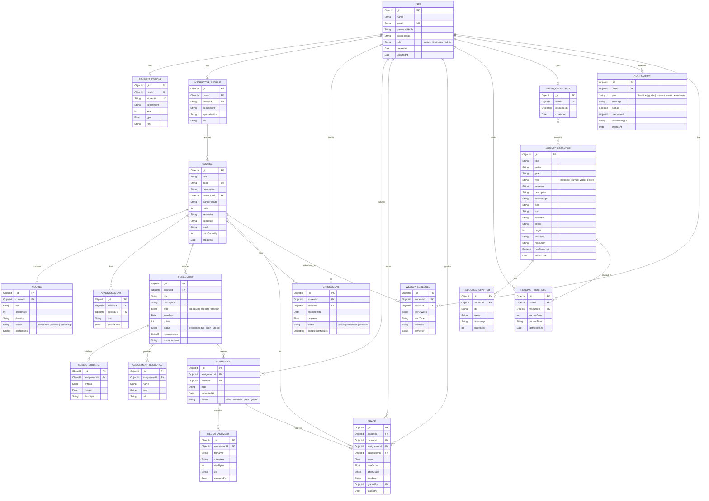

# Entity-Relationship Diagram — ScholarSync LMS

## Database: MongoDB (Document-Oriented)

The ER diagram below represents the logical data model. While MongoDB is schema-less, Mongoose schemas will enforce this structure.

---

## Complete ER Diagram

---

## Cardinality Summary

| Relationship | Cardinality | Description |
|---|---|---|
| User → Student Profile | 1:0..1 | A user may optionally be a student |
| User → Instructor Profile | 1:0..1 | A user may optionally be an instructor |
| Instructor → Courses | 1:N | One instructor teaches many courses |
| Course → Modules | 1:N | One course has many modules |
| Course → Assignments | 1:N | One course has many assignments |
| Student → Enrollments | 1:N | One student enrolls in many courses |
| Assignment → Submissions | 1:N | One assignment receives many submissions |
| Submission → Grade | 1:0..1 | One submission may receive one grade |
| Submission → Files | 1:N | One submission has many file attachments |
| Assignment → Rubric Criteria | 1:N | One assignment defines multiple rubric criteria |
| Library Resource → Chapters | 1:N | One resource has many chapters |
| User → Reading Progress | 1:N | One user tracks progress on many resources |
| User → Saved Collection | 1:1 | One user has one saved collection |
| Saved Collection → Resources | N:M | Many-to-many between collections and resources |

---

## Indexing Strategy

| Collection | Index Fields | Type | Purpose |
|---|---|---|---|
| `users` | `email` | Unique | Fast login lookup |
| `student_profiles` | `studentId` | Unique | Student ID lookup |
| `courses` | `code` | Unique | Course code lookup |
| `courses` | `track`, `semester` | Compound | Filter by track |
| `enrollments` | `studentId`, `courseId` | Compound Unique | Prevent duplicate enrollment |
| `assignments` | `courseId`, `deadline` | Compound | List assignments by deadline |
| `submissions` | `assignmentId`, `studentId` | Compound | Find student's submission |
| `grades` | `studentId`, `courseId` | Compound | Calculate course grade |
| `library_resources` | `title`, `author`, `category` | Text | Full-text search |
| `reading_progress` | `userId`, `resourceId` | Compound Unique | One progress per user-resource |
| `notifications` | `userId`, `isRead` | Compound | Unread notifications |
