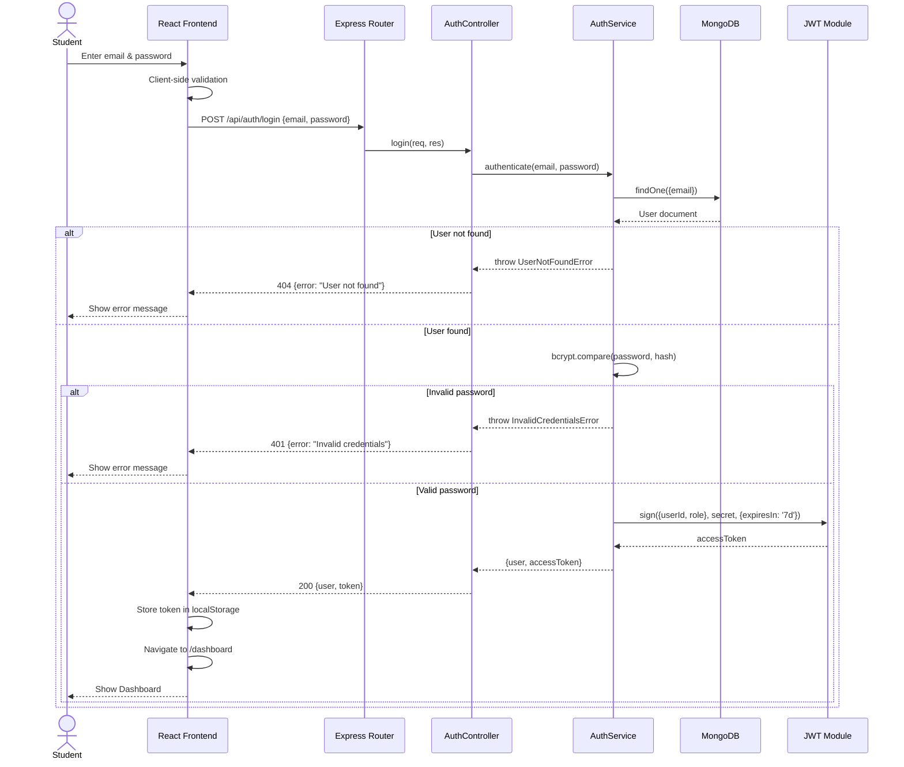
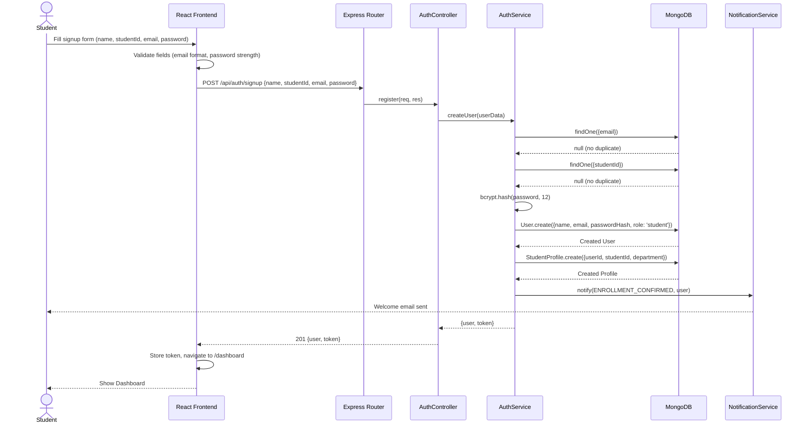
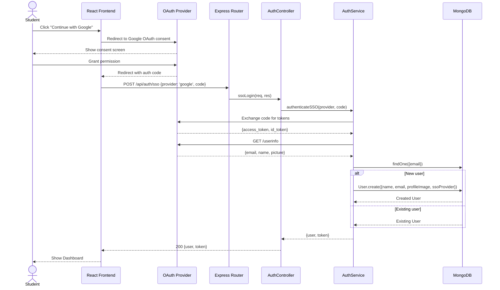
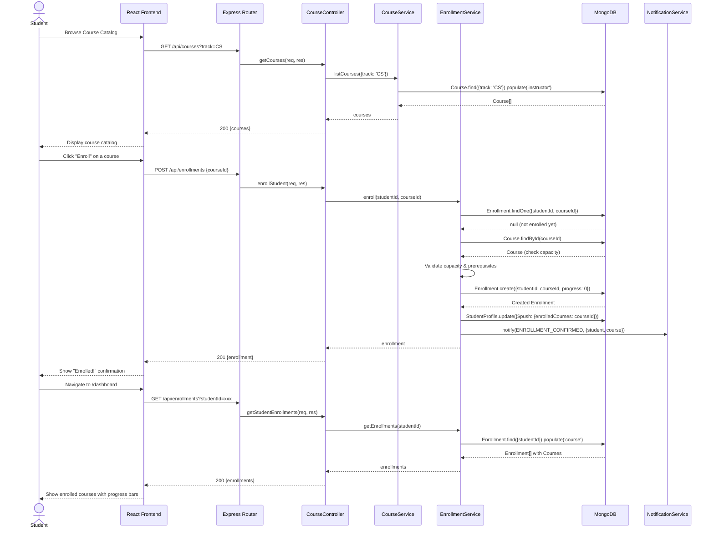
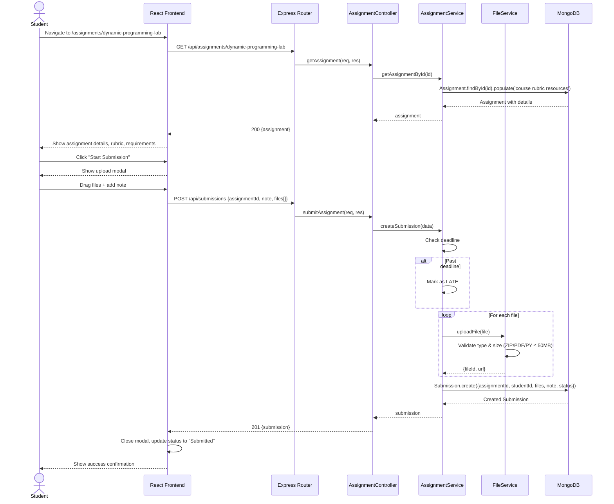
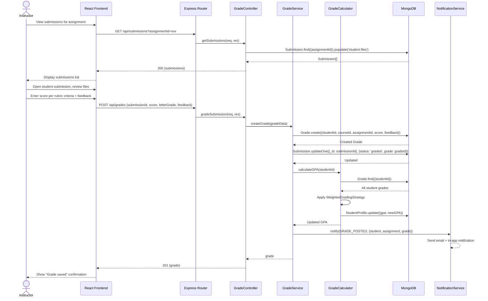
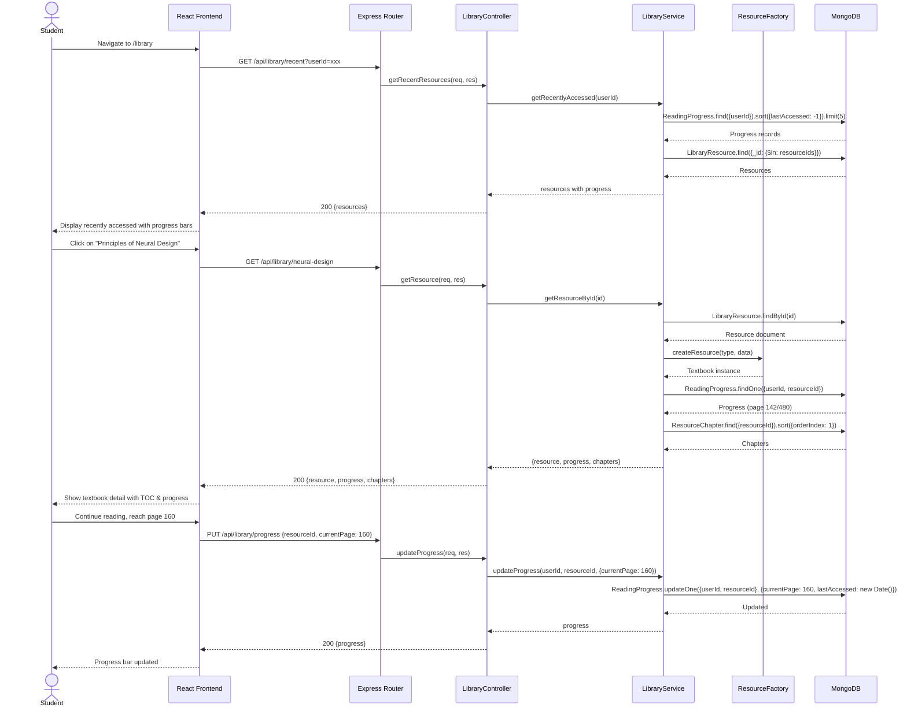
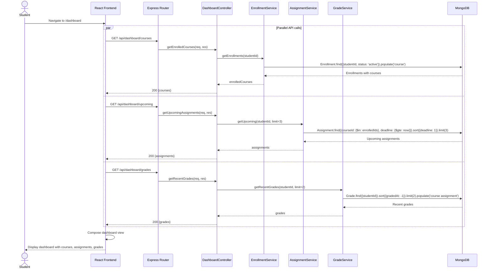
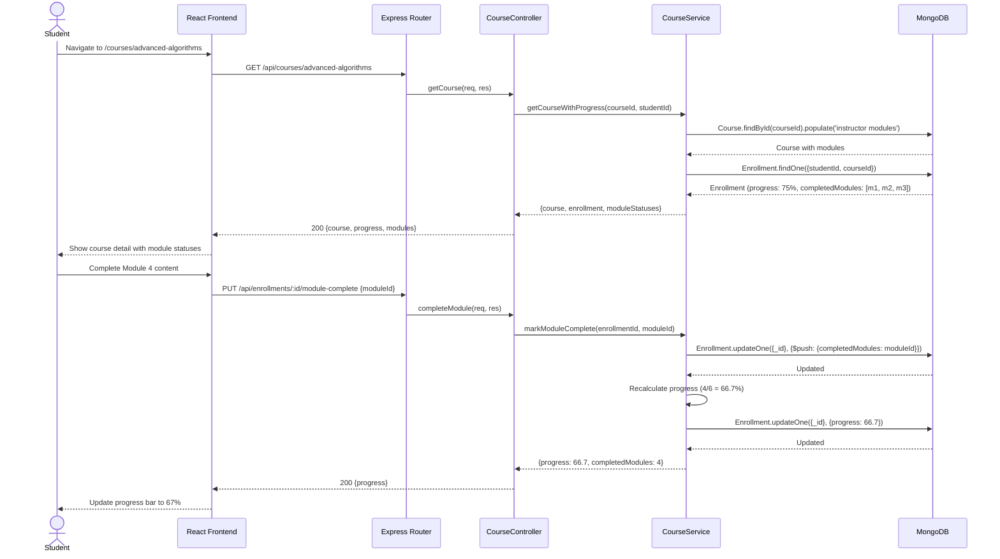
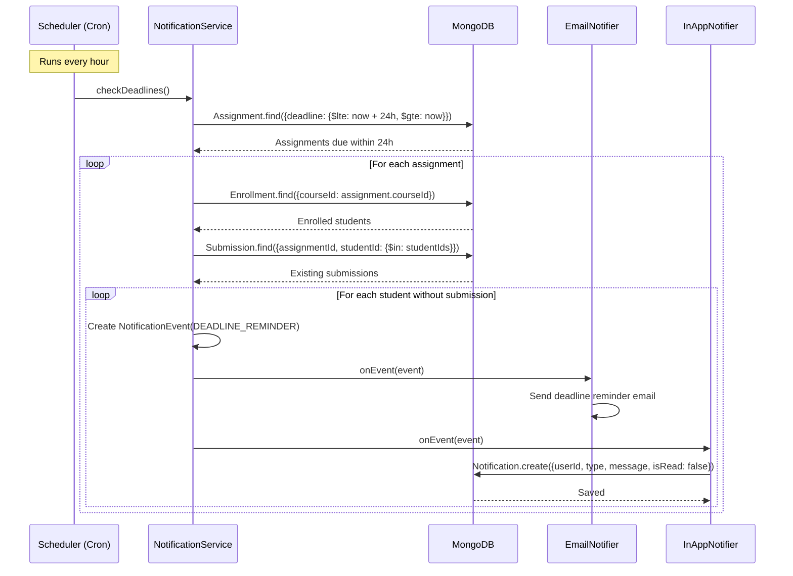

# Sequence Diagrams — ScholarSync LMS

## Overview
These sequence diagrams detail the interaction flow between actors, frontend, backend, and database for all major use cases.

---

## 1. User Authentication (Login)

---

## 2. User Registration (Signup)

---

## 3. SSO Login (Google/Outlook)

---

## 4. Course Enrollment

---

## 5. Assignment Submission

---

## 6. Assignment Grading & Feedback

---

## 7. Library Resource Access & Progress Tracking

---

## 8. Dashboard Data Aggregation

---

## 9. Course Module Progress

---

## 10. Notification Flow (Observer Pattern)

