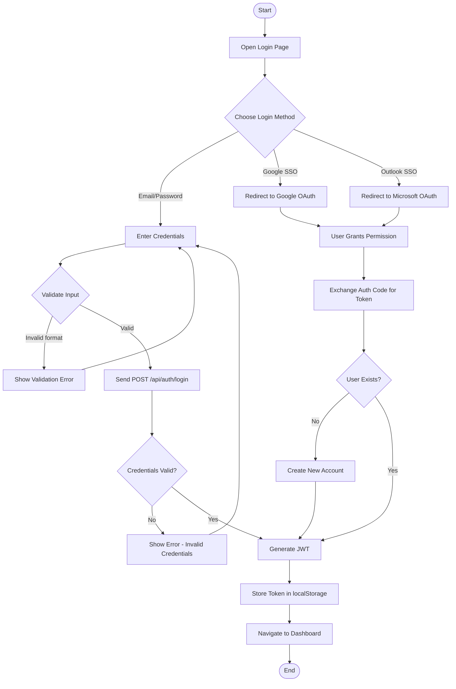
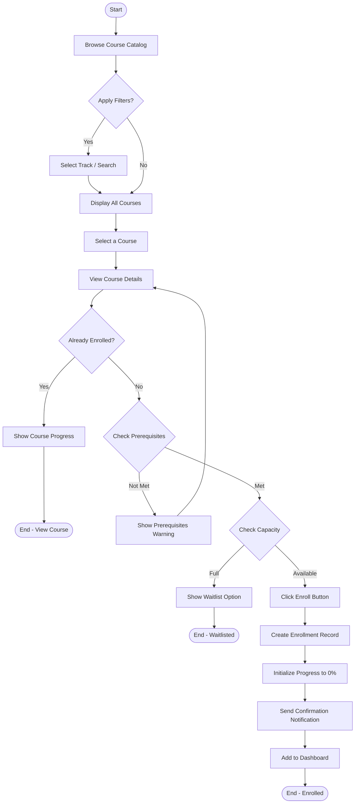
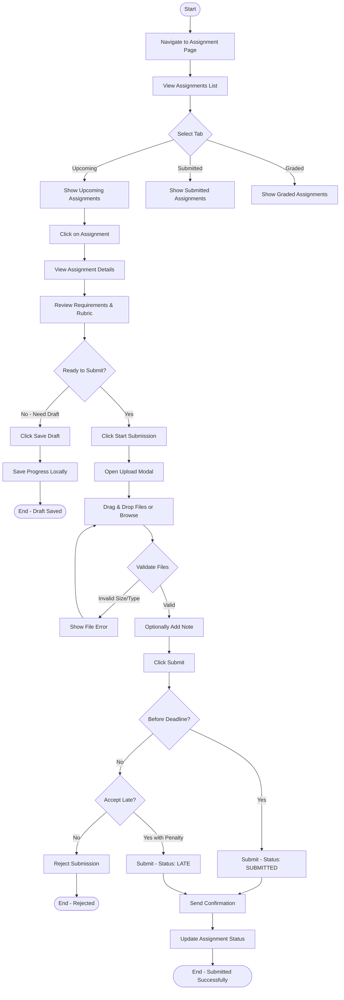
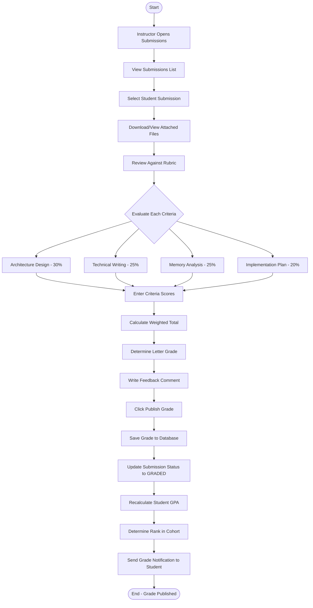
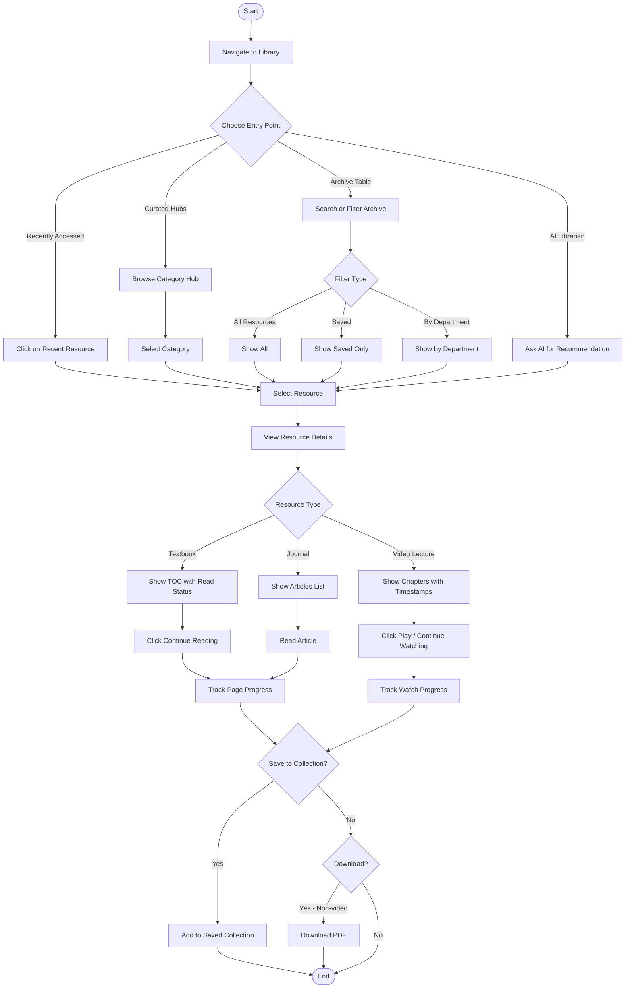
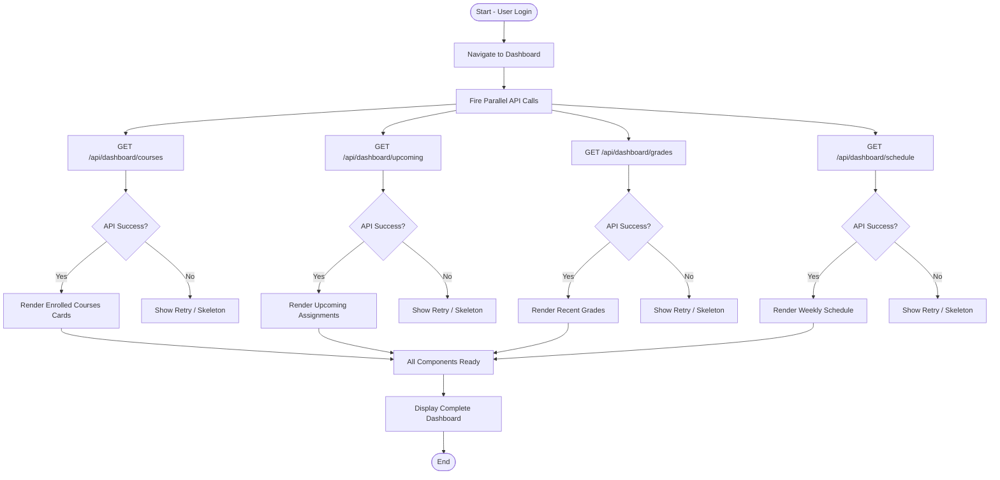
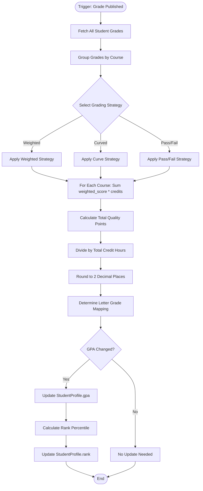

# Activity Diagrams — ScholarSync LMS

## Overview
Activity diagrams model the flow of control and decision-making in key workflows.

---

## 1. Student Login Flow

---

## 2. Course Enrollment Flow

---

## 3. Assignment Submission Flow

---

## 4. Grading Workflow

---

## 5. Library Resource Access Flow

---

## 6. Dashboard Data Loading Flow

---

## 7. GPA Calculation Flow

