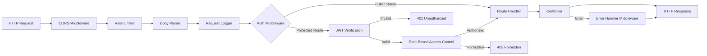
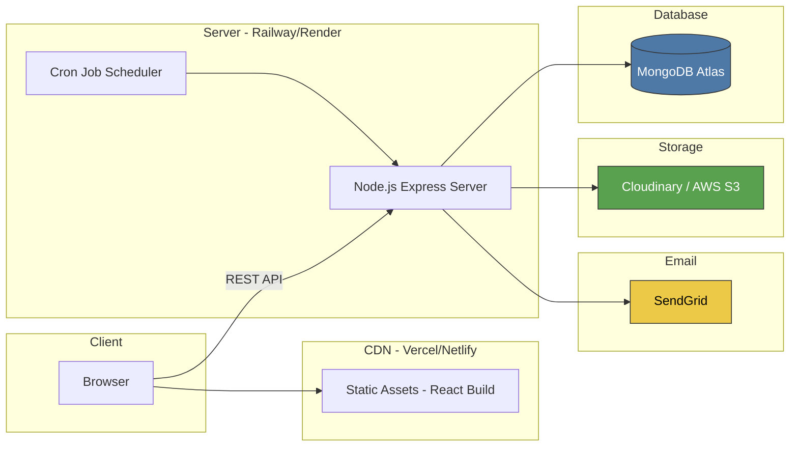

# Architecture & Component Diagram — ScholarSync LMS

## System Architecture Overview

```mermaid
graph TB
    subgraph "Client Layer - React + Vite"
        direction TB
        LP[Landing Page]
        AUTH[Login / Signup Pages]
        DASH[Dashboard Page]
        CP[Courses Page]
        CDP[Course Detail Page]
        AP[Assignments Page]
        ADP[Assignment Detail Page]
        GP[Grades Page]
        LBP[Library Page]
        LBDP[Library Item Page]
    end

    subgraph "Shared Components"
        NAV[SideNavBar]
        TOPNAV[TopNavBar]
        FOOT[Footer]
        RR[React Router]
    end

    subgraph "API Gateway - Express.js"
        direction TB
        MW[Middleware Layer]
        subgraph "Route Layer"
            AR[Auth Routes]
            CR[Course Routes]
            ASR[Assignment Routes]
            GR[Grade Routes]
            LR[Library Routes]
            DR[Dashboard Routes]
            NR[Notification Routes]
        end
    end

    subgraph "Controller Layer"
        AC[AuthController]
        CC[CourseController]
        ASC[AssignmentController]
        GC[GradeController]
        LC[LibraryController]
        DC[DashboardController]
    end

    subgraph "Service Layer - Business Logic"
        AuS[AuthService]
        CoS[CourseService]
        EnS[EnrollmentService]
        AsS[AssignmentService]
        SubS[SubmissionService]
        GrS[GradeService]
        GCal[GradeCalculator]
        LiS[LibraryService]
        NoS[NotificationService]
        FS[FileService]
        RF[ResourceFactory]
    end

    subgraph "Data Access Layer - Repository Pattern"
        UR[UserRepository]
        CRep[CourseRepository]
        ERep[EnrollmentRepository]
        ARep[AssignmentRepository]
        SRep[SubmissionRepository]
        GRep[GradeRepository]
        LRep[LibraryRepository]
        NRep[NotificationRepository]
    end

    subgraph "Database Layer - MongoDB"
        DB[(MongoDB Atlas)]
    end

    subgraph "External Services"
        OAUTH[Google / Microsoft OAuth]
        S3[File Storage - S3/Cloudinary]
        SMTP[Email Service - SendGrid]
        CRON[Task Scheduler - node-cron]
    end

    %% Client → Router
    LP --> RR
    AUTH --> RR
    DASH --> RR
    CP --> RR
    CDP --> RR
    AP --> RR
    ADP --> RR
    GP --> RR
    LBP --> RR
    LBDP --> RR

    %% Router → API
    RR -->|HTTP/REST| MW

    %% Middleware
    MW -->|Auth Check| AR
    MW -->|Auth Check| CR
    MW -->|Auth Check| ASR
    MW -->|Auth Check| GR
    MW -->|Auth Check| LR
    MW -->|Auth Check| DR

    %% Routes → Controllers
    AR --> AC
    CR --> CC
    ASR --> ASC
    GR --> GC
    LR --> LC
    DR --> DC

    %% Controllers → Services
    AC --> AuS
    CC --> CoS
    CC --> EnS
    ASC --> AsS
    ASC --> SubS
    GC --> GrS
    GC --> GCal
    LC --> LiS
    LC --> RF
    DC --> CoS
    DC --> AsS
    DC --> GrS

    %% Services → Repositories
    AuS --> UR
    CoS --> CRep
    EnS --> ERep
    AsS --> ARep
    SubS --> SRep
    GrS --> GRep
    LiS --> LRep
    NoS --> NRep

    %% Repositories → DB
    UR --> DB
    CRep --> DB
    ERep --> DB
    ARep --> DB
    SRep --> DB
    GRep --> DB
    LRep --> DB
    NRep --> DB

    %% External
    AuS --> OAUTH
    SubS --> S3
    FS --> S3
    NoS --> SMTP
    CRON --> NoS

    style DB fill:#4e79a7,stroke:#333,color:#fff
    style MW fill:#e15759,stroke:#333,color:#fff
    style OAUTH fill:#76b7b2,stroke:#333,color:#fff
    style S3 fill:#76b7b2,stroke:#333,color:#fff
    style SMTP fill:#76b7b2,stroke:#333,color:#fff
```



---

## Middleware Pipeline



---

## API Route Structure

| Route | Method | Auth | Role | Description |
|-------|--------|------|------|-------------|
| `/api/auth/login` | POST | ❌ | All | Login with email + password |
| `/api/auth/signup` | POST | ❌ | All | Register new account |
| `/api/auth/sso` | POST | ❌ | All | SSO login (Google/Outlook) |
| `/api/auth/forgot-password` | POST | ❌ | All | Send password reset email |
| `/api/auth/me` | GET | ✅ | All | Get current user profile |
| `/api/courses` | GET | ✅ | All | List courses (with filters) |
| `/api/courses/:id` | GET | ✅ | All | Get course details |
| `/api/courses` | POST | ✅ | Instructor | Create new course |
| `/api/courses/:id` | PUT | ✅ | Instructor | Update course |
| `/api/courses/:id/modules` | GET | ✅ | All | List course modules |
| `/api/courses/:id/announcements` | GET | ✅ | All | List announcements |
| `/api/courses/:id/announcements` | POST | ✅ | Instructor | Post announcement |
| `/api/enrollments` | GET | ✅ | Student | Get my enrollments |
| `/api/enrollments` | POST | ✅ | Student | Enroll in a course |
| `/api/enrollments/:id/module-complete` | PUT | ✅ | Student | Mark module complete |
| `/api/assignments` | GET | ✅ | All | List assignments (with filters) |
| `/api/assignments/:id` | GET | ✅ | All | Get assignment details |
| `/api/assignments` | POST | ✅ | Instructor | Create assignment |
| `/api/submissions` | POST | ✅ | Student | Submit assignment |
| `/api/submissions` | GET | ✅ | Instructor | View submissions |
| `/api/grades` | GET | ✅ | Student | Get my grades |
| `/api/grades` | POST | ✅ | Instructor | Grade a submission |
| `/api/grades/gpa` | GET | ✅ | Student | Get GPA & rank |
| `/api/library` | GET | ✅ | All | Browse library resources |
| `/api/library/:id` | GET | ✅ | All | Get resource details |
| `/api/library/progress` | PUT | ✅ | Student | Update reading/watch progress |
| `/api/library/saved` | GET | ✅ | Student | Get saved collection |
| `/api/library/saved` | POST | ✅ | Student | Save resource to collection |
| `/api/dashboard/overview` | GET | ✅ | Student | Dashboard aggregated data |
| `/api/notifications` | GET | ✅ | All | Get notifications |
| `/api/notifications/:id/read` | PUT | ✅ | All | Mark notification as read |

---

## Deployment Architecture



---

## Folder Structure (Backend)

```
server/
├── config/
│   ├── db.js                    # MongoDB connection (Singleton)
│   ├── env.js                   # Environment variables
│   └── cors.js                  # CORS configuration
├── middleware/
│   ├── auth.js                  # JWT verification
│   ├── rbac.js                  # Role-based access control
│   ├── errorHandler.js          # Global error handler
│   ├── rateLimiter.js           # Rate limiting
│   └── validator.js             # Request validation
├── routes/
│   ├── authRoutes.js
│   ├── courseRoutes.js
│   ├── assignmentRoutes.js
│   ├── gradeRoutes.js
│   ├── libraryRoutes.js
│   ├── dashboardRoutes.js
│   └── notificationRoutes.js
├── controllers/
│   ├── AuthController.js
│   ├── CourseController.js
│   ├── AssignmentController.js
│   ├── GradeController.js
│   ├── LibraryController.js
│   └── DashboardController.js
├── services/
│   ├── AuthService.js
│   ├── CourseService.js
│   ├── EnrollmentService.js
│   ├── AssignmentService.js
│   ├── SubmissionService.js
│   ├── GradeService.js
│   ├── GradeCalculator.js       # Strategy Pattern
│   ├── LibraryService.js
│   ├── ResourceFactory.js       # Factory Pattern
│   ├── NotificationService.js   # Observer Pattern
│   └── FileService.js
├── repositories/
│   ├── IRepository.js           # Interface (abstract)
│   ├── UserRepository.js
│   ├── CourseRepository.js
│   ├── EnrollmentRepository.js
│   ├── AssignmentRepository.js
│   ├── SubmissionRepository.js
│   ├── GradeRepository.js
│   ├── LibraryRepository.js
│   └── NotificationRepository.js
├── models/
│   ├── User.js
│   ├── StudentProfile.js
│   ├── InstructorProfile.js
│   ├── Course.js
│   ├── Module.js
│   ├── Enrollment.js
│   ├── Announcement.js
│   ├── Assignment.js
│   ├── RubricCriteria.js
│   ├── Submission.js
│   ├── FileAttachment.js
│   ├── Grade.js
│   ├── LibraryResource.js
│   ├── ResourceChapter.js
│   ├── ReadingProgress.js
│   ├── SavedCollection.js
│   └── Notification.js
├── strategies/
│   ├── IGradingStrategy.js      # Interface
│   ├── WeightedGradingStrategy.js
│   └── CurveGradingStrategy.js
├── observers/
│   ├── INotificationObserver.js # Interface
│   ├── EmailNotifier.js
│   └── InAppNotifier.js
├── utils/
│   ├── jwt.js
│   ├── bcrypt.js
│   └── logger.js
├── app.js                       # Express app setup
└── server.js                    # Entry point
```
