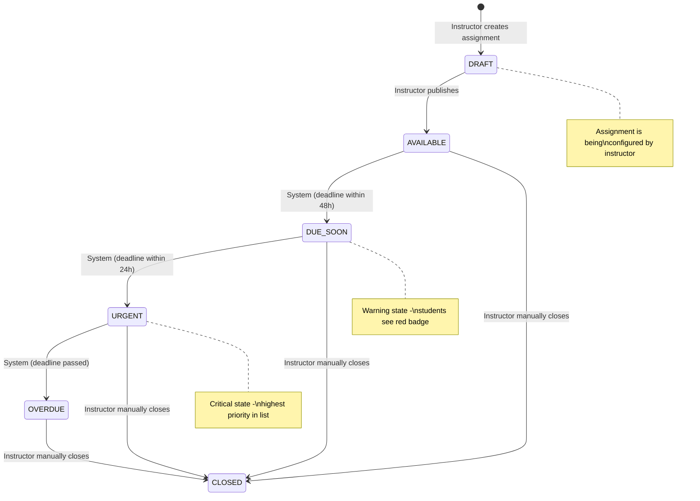
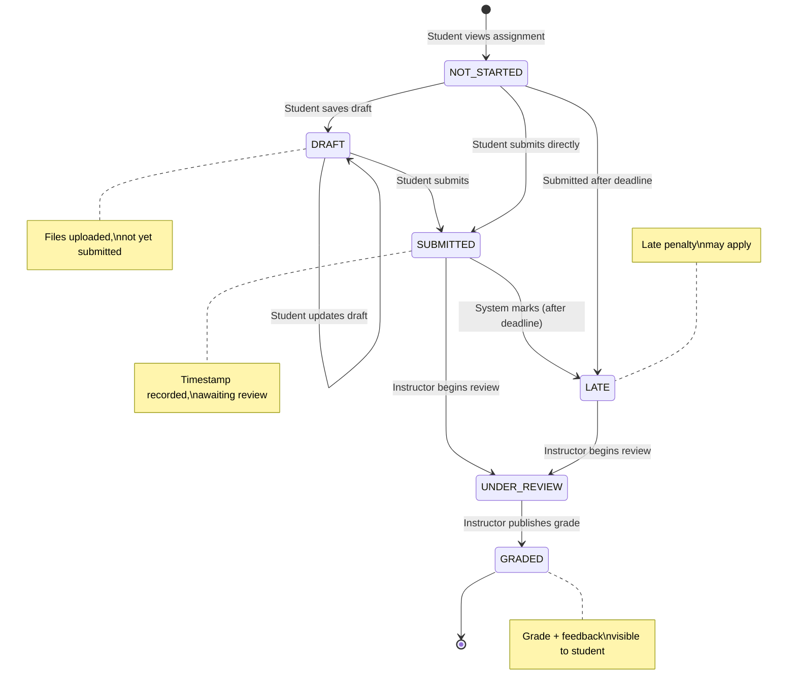
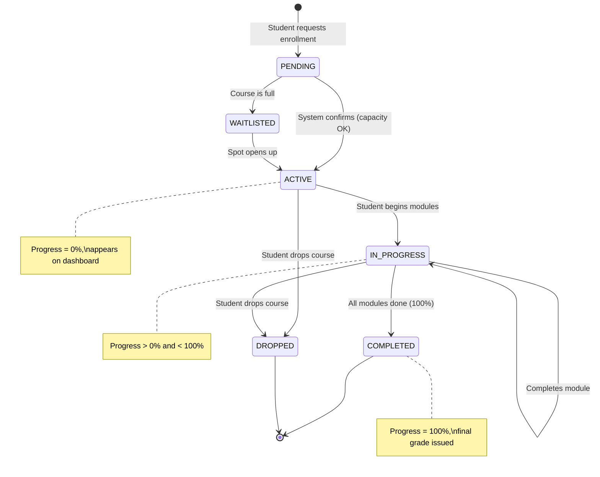
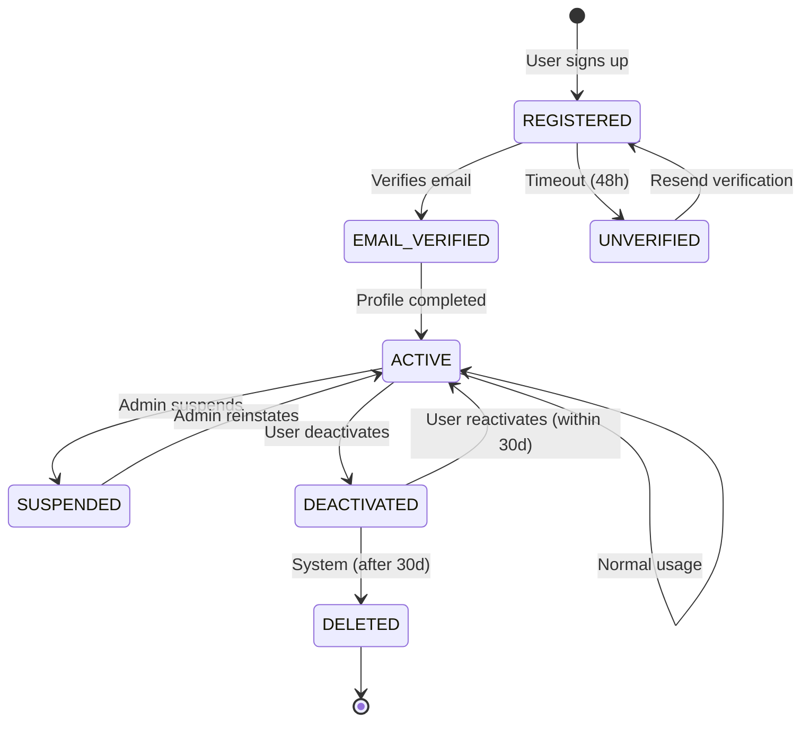
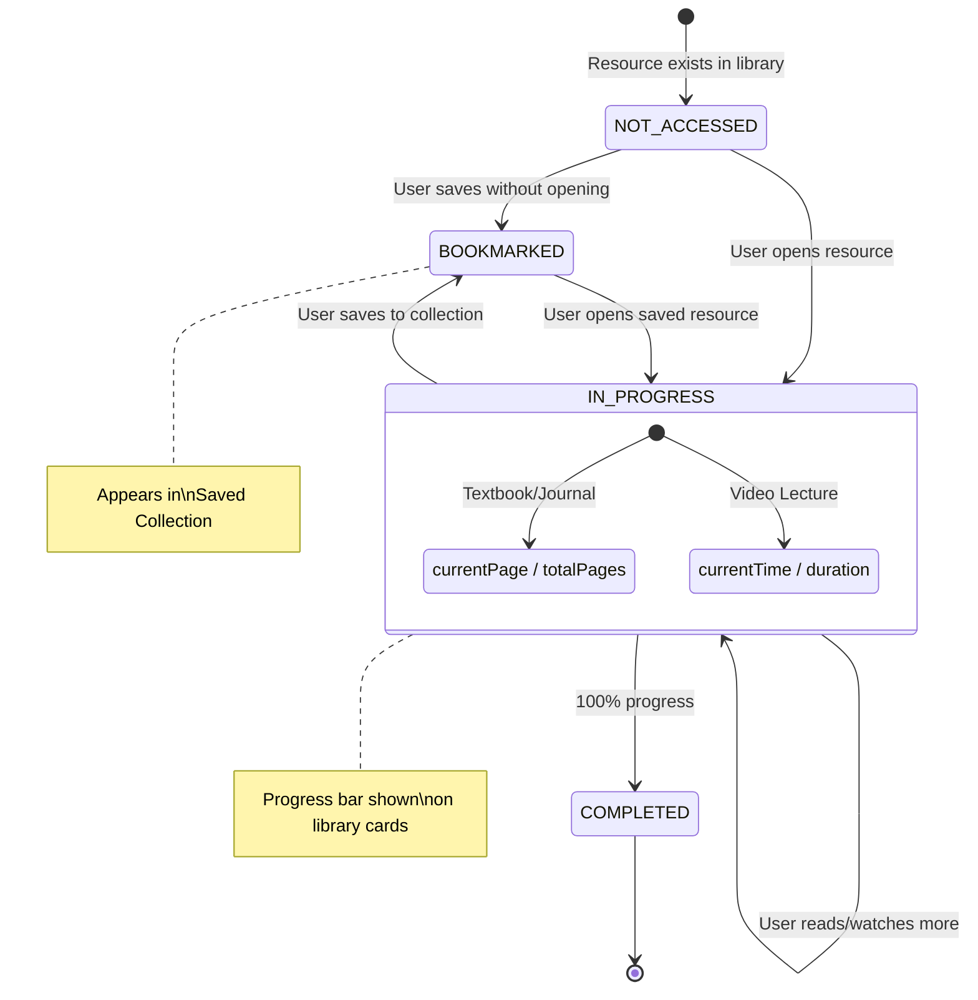
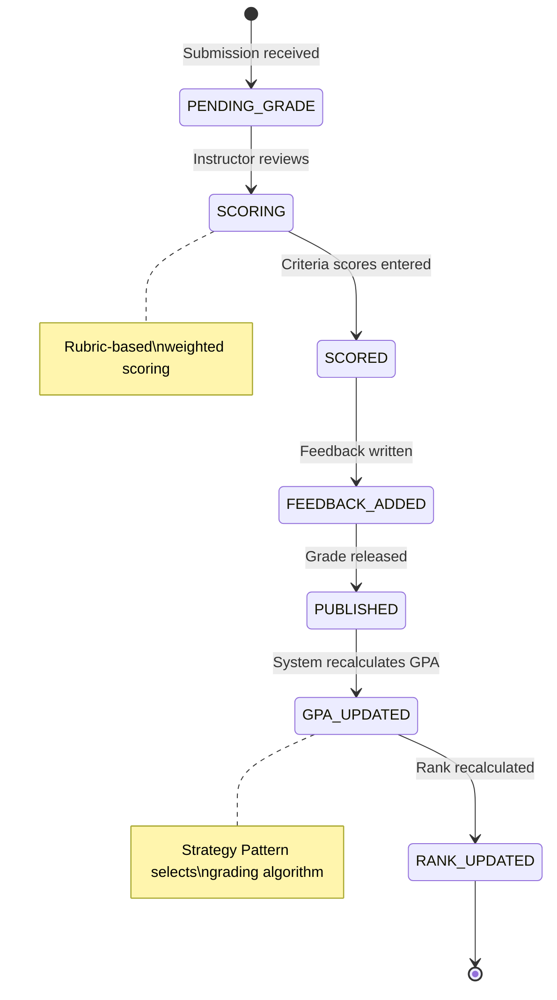

# State Machine Diagram — ScholarSync LMS

## Overview
State machine diagrams define the valid lifecycle states and transitions for key domain entities.

---

## 1. Assignment Status Lifecycle



---

## 2. Submission Lifecycle



---

## 3. Enrollment Lifecycle



---

## 4. User Account Lifecycle



---

## 5. Library Resource Progress Lifecycle



---

## 6. Notification Lifecycle

```mermaid
stateDiagram-v2
    [*] --> CREATED : System generates notification

    CREATED --> DELIVERED : Push/Email sent
    DELIVERED --> READ : User views notification
    READ --> DISMISSED : User dismisses
    
    DELIVERED --> EXPIRED : TTL exceeded (7d)
    CREATED --> EXPIRED : Delivery failed

    DISMISSED --> [*]
    EXPIRED --> [*]

    note right of CREATED : Types: deadline_reminder,\ngrade_posted, announcement,\nenrollment_confirmed
```

---

## 7. Grade Calculation State


