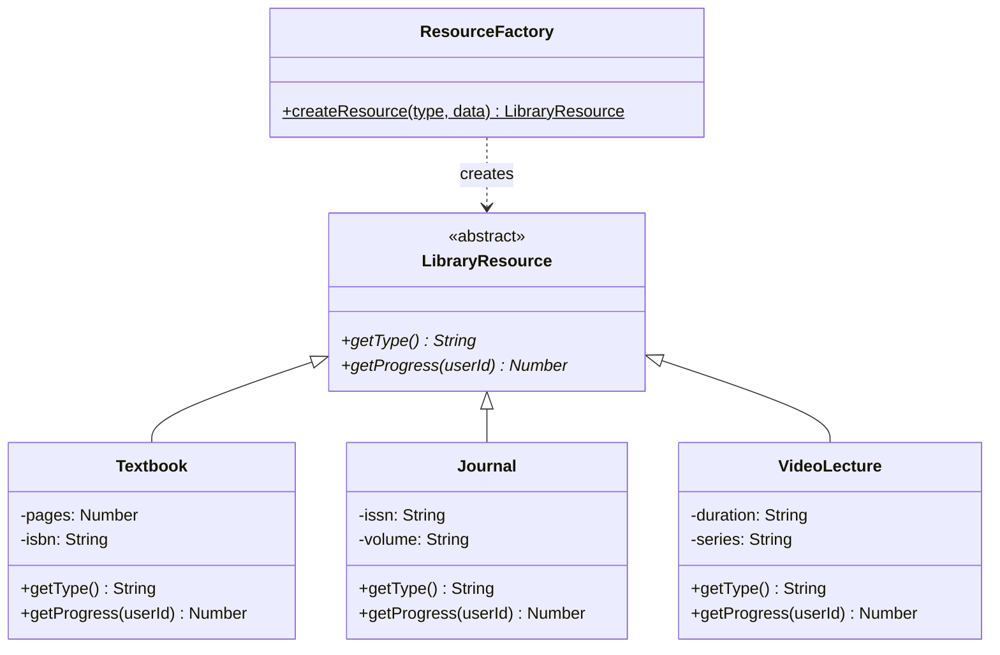
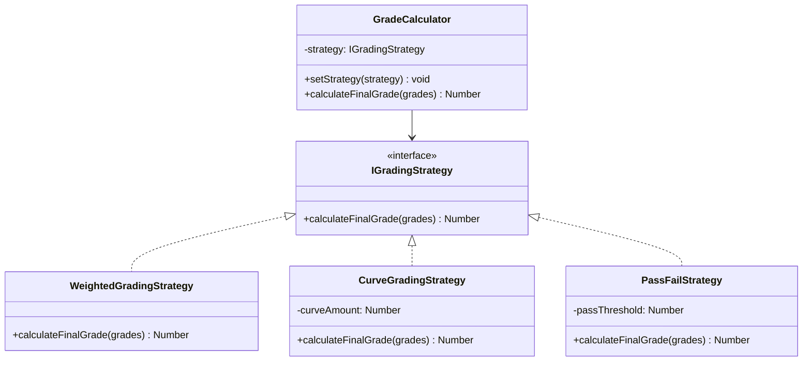
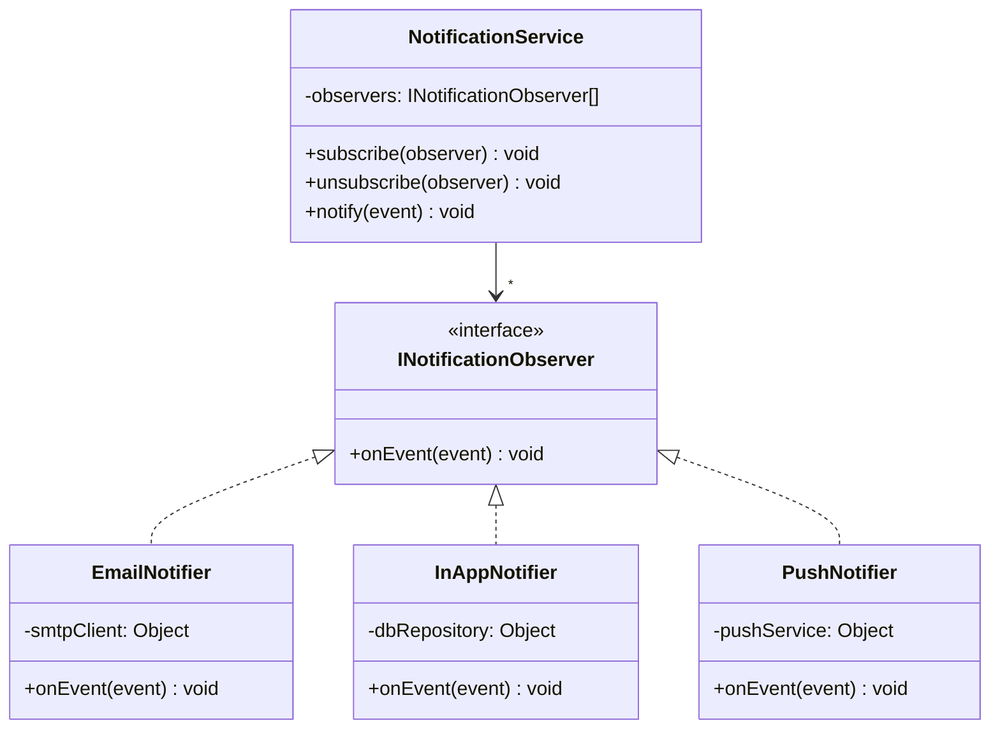
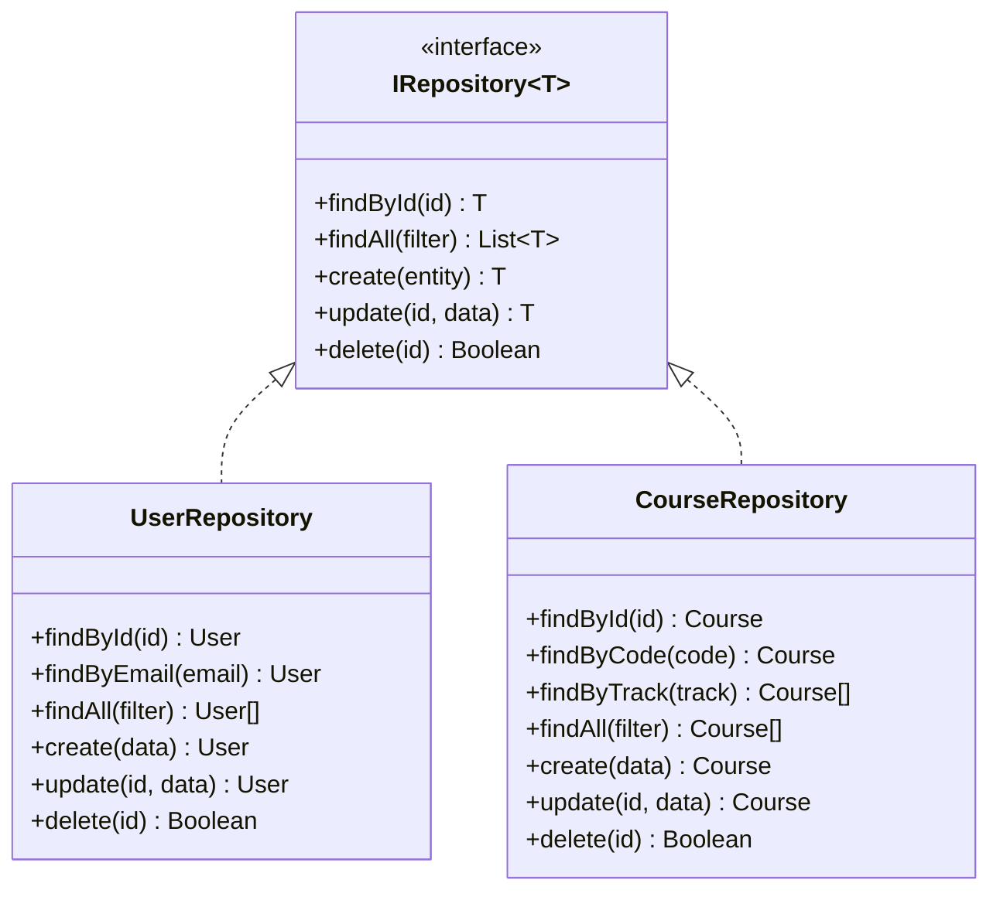
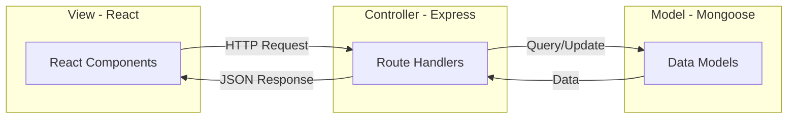
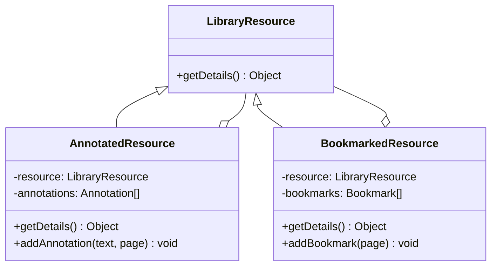

# Design Patterns — ScholarSync LMS

## Overview
This document details how each design pattern is applied in the ScholarSync system, with concrete code examples showing the implementation approach.

---

## 1. Factory Pattern — Resource Creation

**Problem**: The library contains multiple resource types (Textbook, Journal, VideoLecture) that share a common interface but have different properties and behaviors.

**Solution**: `ResourceFactory` creates the appropriate resource instance based on the `type` field.



**Pseudocode**:
```javascript
class ResourceFactory {
  static createResource(type, data) {
    switch (type) {
      case 'textbook':   return new Textbook(data);
      case 'journal':    return new Journal(data);
      case 'video':      return new VideoLecture(data);
      default: throw new Error(`Unknown resource type: ${type}`);
    }
  }
}
```

**SOLID Principle**: Open/Closed — adding a new resource type (e.g., `Podcast`) requires only adding a new class and a case, without modifying existing resource classes.

---

## 2. Strategy Pattern — Grading Algorithms

**Problem**: Different courses may use different grading approaches (weighted average, curve-based, pass/fail).

**Solution**: `GradeCalculator` delegates grade computation to an interchangeable `IGradingStrategy`.



**Pseudocode**:
```javascript
// Interface
class IGradingStrategy {
  calculateFinalGrade(grades) { throw new Error('Not implemented'); }
}

// Concrete Strategy 1
class WeightedGradingStrategy extends IGradingStrategy {
  calculateFinalGrade(grades) {
    return grades.reduce((sum, g) =>
      sum + (g.score / g.maxScore) * g.rubric.weight, 0
    );
  }
}

// Concrete Strategy 2
class CurveGradingStrategy extends IGradingStrategy {
  constructor(curveAmount) { this.curveAmount = curveAmount; }
  calculateFinalGrade(grades) {
    const raw = grades.reduce((s, g) => s + g.score, 0) / grades.length;
    return Math.min(100, raw + this.curveAmount);
  }
}

// Context
class GradeCalculator {
  setStrategy(strategy) { this.strategy = strategy; }
  calculateFinalGrade(grades) { return this.strategy.calculateFinalGrade(grades); }
}
```

**SOLID Principle**: Single Responsibility + Open/Closed — each strategy handles one algorithm; new strategies don't affect existing ones.

---

## 3. Observer Pattern — Notifications

**Problem**: When events happen (grade posted, deadline approaching, new announcement), multiple notification channels (email, in-app) need to react independently.

**Solution**: `NotificationService` acts as the subject; `EmailNotifier` and `InAppNotifier` are observers.



**Pseudocode**:
```javascript
class NotificationService {
  constructor() { this.observers = []; }

  subscribe(observer) { this.observers.push(observer); }
  unsubscribe(observer) {
    this.observers = this.observers.filter(o => o !== observer);
  }

  notify(event) {
    this.observers.forEach(observer => observer.onEvent(event));
  }
}

class EmailNotifier {
  onEvent(event) {
    if (event.type === 'GRADE_POSTED') {
      sendEmail(event.payload.studentEmail, 'Grade Posted', ...);
    }
  }
}

class InAppNotifier {
  onEvent(event) {
    Notification.create({
      userId: event.payload.studentId,
      type: event.type,
      message: event.message,
      isRead: false
    });
  }
}
```

**SOLID Principle**: Dependency Inversion — `NotificationService` depends on the `INotificationObserver` abstraction, not concrete notifiers. Interface Segregation — each observer only handles what it needs.

---

## 4. Repository Pattern — Data Access

**Problem**: Business logic should not directly depend on MongoDB/Mongoose implementation details.

**Solution**: `IRepository<T>` interface abstracts CRUD operations; concrete repositories implement it per entity.



**Pseudocode**:
```javascript
// Abstract Repository
class IRepository {
  findById(id) { throw new Error('Not implemented'); }
  findAll(filter) { throw new Error('Not implemented'); }
  create(entity) { throw new Error('Not implemented'); }
  update(id, data) { throw new Error('Not implemented'); }
  delete(id) { throw new Error('Not implemented'); }
}

// Concrete Repository
class CourseRepository extends IRepository {
  async findById(id) {
    return await Course.findById(id).populate('instructor modules');
  }
  async findByTrack(track) {
    return await Course.find({ track }).sort({ title: 1 });
  }
  async create(data) {
    return await Course.create(data);
  }
  // ...
}
```

**SOLID Principle**: Dependency Inversion — services depend on `IRepository`, making it easy to swap from MongoDB to PostgreSQL without changing business logic.

---

## 5. Singleton Pattern — Database Connection

**Problem**: Multiple database connections waste resources and create consistency issues.

**Solution**: A single shared MongoDB connection instance.

```javascript
class Database {
  static instance = null;

  static getInstance() {
    if (!Database.instance) {
      Database.instance = new Database();
    }
    return Database.instance;
  }

  async connect() {
    if (this.connection) return this.connection;
    this.connection = await mongoose.connect(process.env.MONGO_URI);
    console.log('MongoDB connected');
    return this.connection;
  }
}
```

---

## 6. MVC Pattern — Overall Architecture

**Problem**: Need clean separation between data, business logic, and presentation.



| Layer | Technology | Responsibility |
|-------|-----------|---------------|
| **Model** | Mongoose Schemas | Data structure, validation, database access |
| **View** | React Components | User interface rendering |
| **Controller** | Express Routes + Controllers | Request handling, business logic orchestration |

---

## 7. Decorator Pattern — Resource Annotations

**Problem**: Users want to add annotations, bookmarks, and highlights to library resources without modifying the base resource classes.



---

## Summary Table

| Pattern | Component | OOP Principle | SOLID Principle |
|---------|-----------|--------------|-----------------|
| **Factory** | `ResourceFactory` | Polymorphism | Open/Closed |
| **Strategy** | `GradeCalculator` | Polymorphism | Single Responsibility, Open/Closed |
| **Observer** | `NotificationService` | Abstraction | Dependency Inversion, Interface Segregation |
| **Repository** | Data Access Layer | Encapsulation | Dependency Inversion |
| **Singleton** | `Database` | Encapsulation | Single Responsibility |
| **MVC** | Full Architecture | Separation of Concerns | Single Responsibility |
| **Decorator** | `AnnotatedResource` | Inheritance + Composition | Open/Closed |

