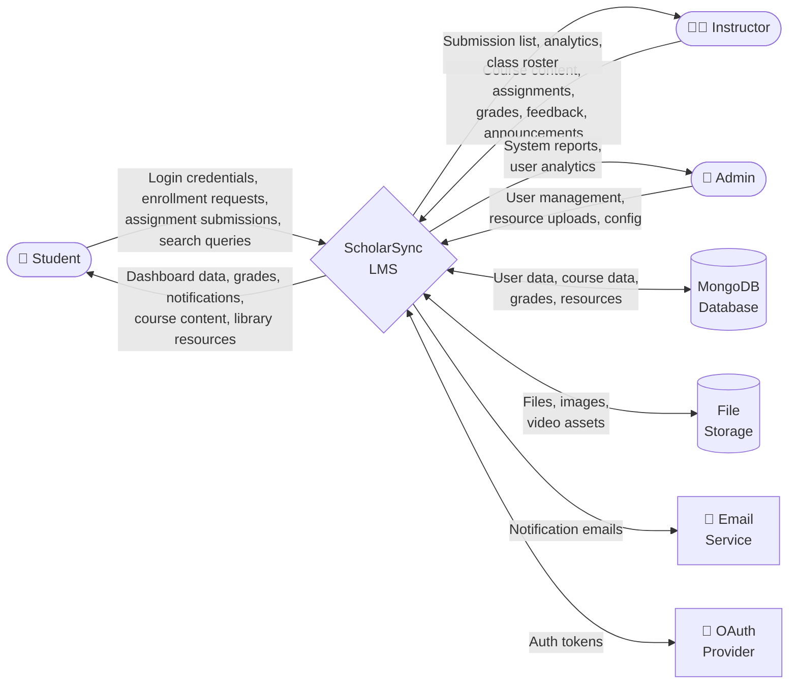
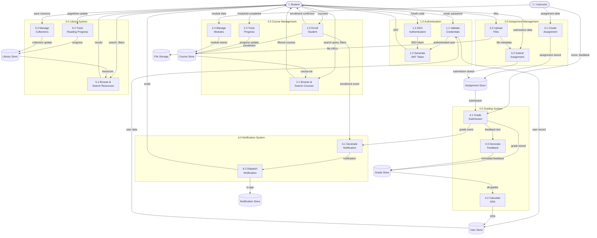
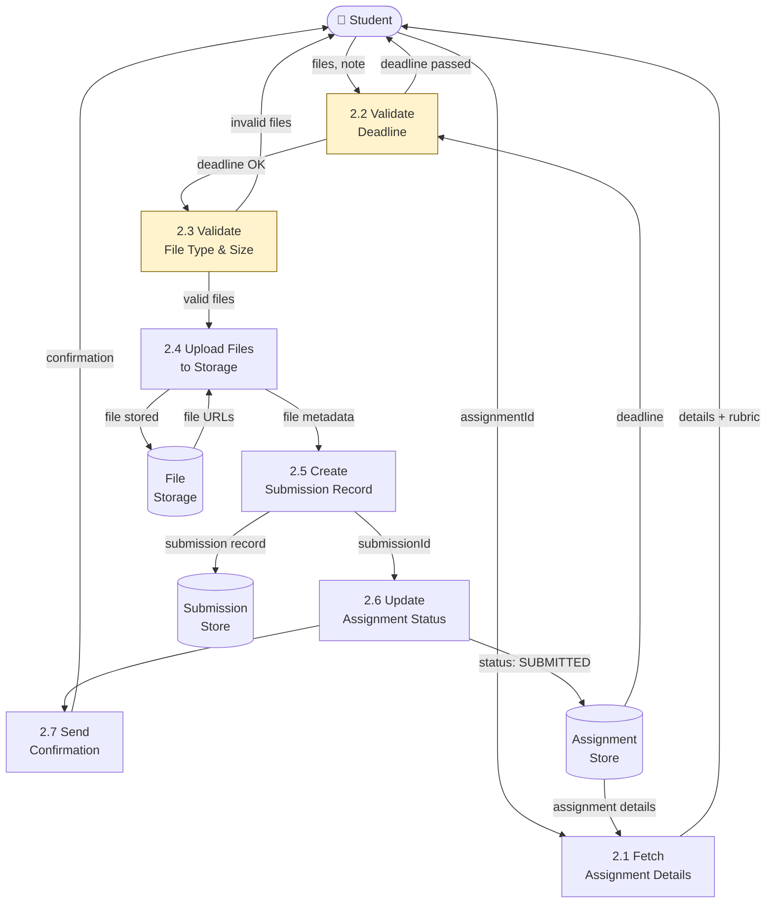

# Data Flow Diagrams — ScholarSync LMS

## Overview
Data Flow Diagrams (DFDs) show how data moves through the system at different levels of abstraction.

---

## Level 0 — Context Diagram



---

## Level 1 — Major Processes



---

## Level 2 — Assignment Submission Process (Detailed)



---

## Level 2 — GPA Calculation Process (Detailed)

```mermaid
graph TB
    TRIGGER([Grade Published\nEvent])

    P1[4.2.1 Fetch All\nStudent Grades]
    P2[4.2.2 Group by\nCourse]
    P3[4.2.3 Select Grading\nStrategy]
    P4[4.2.4 Calculate\nCourse Grades]
    P5[4.2.5 Compute\nWeighted GPA]
    P6[4.2.6 Determine\nRank Percentile]
    P7[4.2.7 Update\nStudent Profile]

    GDB[(Grade\nStore)]
    CDB[(Course\nStore)]
    UDB[(User\nStore)]

    TRIGGER --> P1
    GDB -->|grade records| P1
    P1 -->|grades[]| P2
    CDB -->|course credits| P2
    P2 -->|grouped data| P3

    P3 -->|weighted| P4
    P3 -->|curved| P4
    P3 -->|pass/fail| P4

    P4 -->|course grades| P5
    P5 -->|GPA: 3.88| P6
    UDB -->|cohort GPAs| P6
    P6 -->|rank: Top 5%| P7
    P7 -->|updated profile| UDB

    style P3 fill:#d4edda,stroke:#155724
```

---

## Data Dictionary

| Data Flow | Source | Destination | Contents |
|---|---|---|---|
| Login Credentials | Student/Instructor | Auth Process | `{email, password}` or `{ssoProvider, authCode}` |
| JWT Token | Auth Process | Client | `{token, userId, role, expiresIn}` |
| Course Search Query | Client | Course Process | `{query?, track?, semester?}` |
| Course List | Course Store | Client | `[{id, title, code, instructor, progress, banner}]` |
| Enrollment Request | Student | Enrollment Process | `{studentId, courseId}` |
| Module Completion | Student | Progress Process | `{enrollmentId, moduleId}` |
| Assignment Data | Instructor | Assignment Store | `{title, description, type, deadline, points, rubric[], requirements[]}` |
| Submission | Student | Submission Store | `{assignmentId, studentId, files[], note, submittedAt}` |
| File Upload | Student | File Storage | `{file: binary, filename, mimetype, size}` |
| Grade | Instructor | Grade Store | `{studentId, assignmentId, score, letterGrade, feedback}` |
| GPA | Grade Calculator | User Store | `{studentId, gpa: float, rank: string}` |
| Search Query | Student | Library Process | `{query, type?, category?, department?}` |
| Reading Progress | Student | Library Store | `{userId, resourceId, currentPage}` |
| Watch Progress | Student | Library Store | `{userId, resourceId, currentTime}` |
| Notification | System | Notification Store | `{userId, type, message, referenceId, isRead}` |
| Email | Notification Process | Email Service | `{to, subject, body, template}` |

