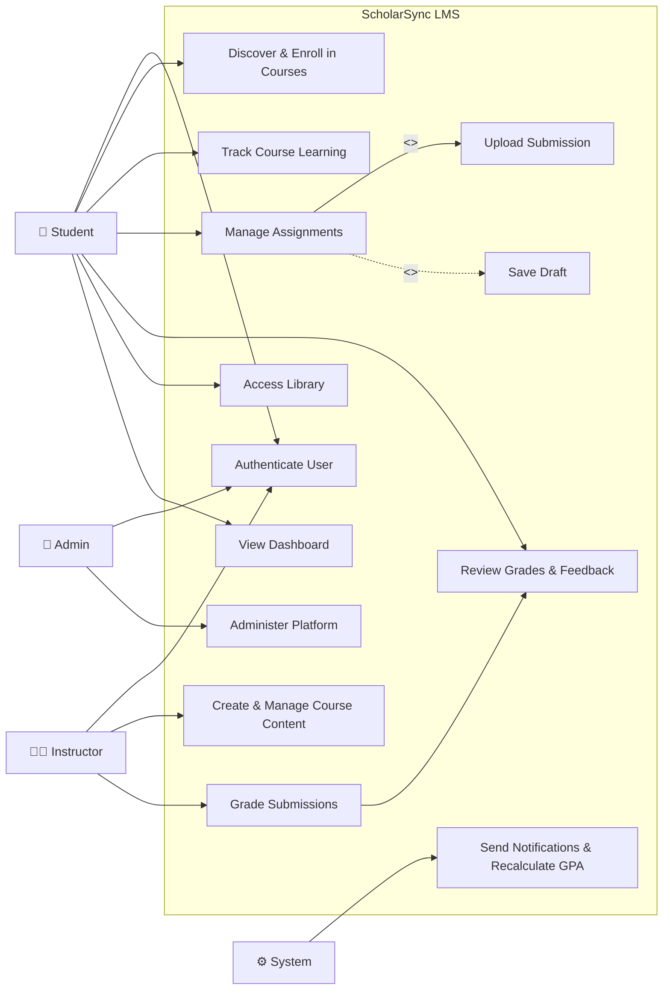

# Use Case Diagram — ScholarSync LMS

## Overview
This diagram provides a compact, high-level view of actor-system interactions in ScholarSync LMS.
Detailed sub-use-cases and step-by-step flows are documented in the use case descriptions below.

### Actors
- **Student** — Primary user who enrolls in courses, submits assignments, views grades, and uses the library
- **Instructor** — Creates courses, assignments, provides feedback and grades
- **Admin** — Manages platform, users, and system-wide settings
- **System** — Automated processes like deadline notifications, GPA calculation

---

## Main Use Case Diagram

---

## Detailed Use Case Descriptions

> **Note:** The main diagram uses grouped high-level use cases for readability.
> Detailed entries such as UC10, UC20, and UC32 below represent expanded sub-use-cases of those high-level areas.

### UC1: Login with Email/Student ID
| Field | Description |
|-------|-------------|
| **Actor** | Student, Instructor, Admin |
| **Precondition** | User has a registered account |
| **Main Flow** | 1. User enters email/student ID and password 2. System validates credentials 3. System redirects to Dashboard |
| **Alternate Flow** | Invalid credentials → show error message |
| **Postcondition** | User is authenticated and has a valid session |

### UC10: Enroll in Course
| Field | Description |
|-------|-------------|
| **Actor** | Student |
| **Precondition** | Student is logged in, course exists and has capacity |
| **Main Flow** | 1. Student browses catalog 2. Selects a course 3. Clicks enroll 4. System adds enrollment record 5. Course appears in student's dashboard |
| **Alternate Flow** | Prerequisites not met → show error |
| **Postcondition** | Student is enrolled, progress initialized to 0% |

### UC20: Submit Assignment
| Field | Description |
|-------|-------------|
| **Actor** | Student |
| **Precondition** | Student is enrolled in the course, assignment is not past deadline |
| **Main Flow** | 1. Student opens assignment detail 2. Uploads file(s) 3. Optionally adds a note 4. Clicks submit 5. System records submission with timestamp |
| **Alternate Flow** | Past deadline → late penalty applied or rejected |
| **Postcondition** | Submission is recorded, status changes to "Submitted" |

### UC32: Grade Assignment
| Field | Description |
|-------|-------------|
| **Actor** | Instructor |
| **Precondition** | Student has submitted the assignment |
| **Main Flow** | 1. Instructor views submissions 2. Reviews student work 3. Assigns grade per rubric criteria 4. Writes feedback 5. Publishes grade |
| **Postcondition** | Grade and feedback visible to student, GPA recalculated |
