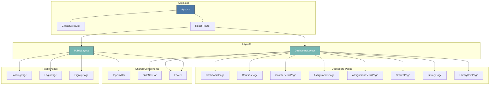
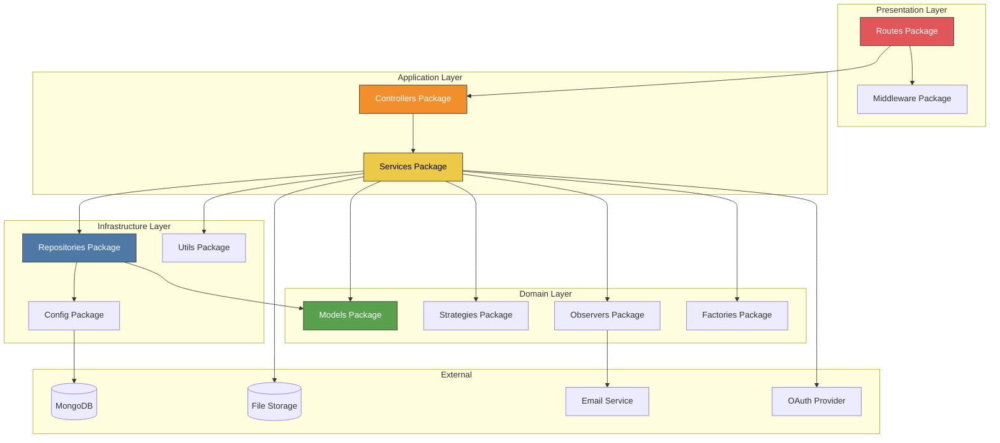
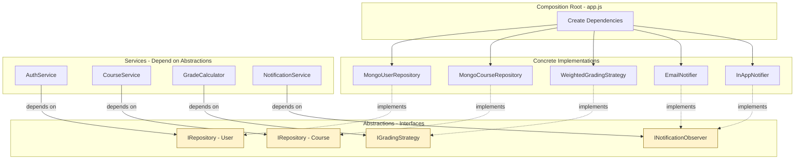

# Component & Package Diagram — ScholarSync LMS

## Overview
This diagram shows the high-level component structure and the dependencies between packages in the system.

---

## Frontend Component Hierarchy



---

## Backend Package Architecture



---

## Package Dependencies Matrix

| Package | Depends On | Depended By |
|---------|-----------|-------------|
| **Routes** | Middleware, Controllers | App Entry |
| **Middleware** | Utils (JWT) | Routes |
| **Controllers** | Services | Routes |
| **Services** | Models, Repositories, Strategies, Observers, Factories | Controllers |
| **Models** | — (leaf) | Services, Repositories |
| **Repositories** | Models, Config | Services |
| **Strategies** | — (leaf) | Services |
| **Observers** | External (SMTP) | Services |
| **Factories** | Models | Services |
| **Config** | External (MongoDB) | Repositories, App |
| **Utils** | — (leaf) | Middleware, Services |

---

## Component Interaction — Course Enrollment Flow

```mermaid
graph LR
    subgraph "React Client"
        UI[CoursesPage\nComponent]
    end

    subgraph "Express Server"
        R[courseRoutes.js]
        M[auth.js\nmiddleware]
        C[CourseController]
    end

    subgraph "Business Logic"
        ES[EnrollmentService]
        NS[NotificationService]
    end

    subgraph "Data Access"
        ER[EnrollmentRepository]
        CR[CourseRepository]
    end

    subgraph "Database"
        DB[(MongoDB)]
    end

    UI -->|POST /api/enrollments| R
    R -->|verify token| M
    M -->|authorized| C
    C -->|enroll(studentId, courseId)| ES
    ES -->|findById(courseId)| CR
    CR -->|query| DB
    ES -->|create enrollment| ER
    ER -->|insert| DB
    ES -->|notify| NS
    NS -->|email + in-app| DB
    
    DB -->|enrollment| ER
    ER -->|result| ES
    ES -->|enrollment| C
    C -->|201 JSON| UI
```

---

## Component Interaction — Grade Publishing Flow

```mermaid
graph LR
    subgraph "React Client"
        UI[GradingView\nComponent]
    end

    subgraph "Express Server"
        R[gradeRoutes.js]
        M[rbac.js\nmiddleware]
        C[GradeController]
    end

    subgraph "Business Logic"
        GS[GradeService]
        GC[GradeCalculator]
        WS[WeightedStrategy]
        NS[NotificationService]
        EN[EmailNotifier]
        IN[InAppNotifier]
    end

    subgraph "Data Access"
        GR[GradeRepository]
        SR[StudentRepository]
    end

    subgraph "Database"
        DB[(MongoDB)]
    end

    UI -->|POST /api/grades| R
    R -->|role: instructor| M
    M -->|authorized| C
    C -->|publishGrade(data)| GS
    GS -->|create grade| GR
    GR -->|insert| DB
    GS -->|recalculate| GC
    GC -->|use strategy| WS
    WS -->|weighted avg| GC
    GC -->|update GPA| SR
    SR -->|update| DB
    GS -->|notify| NS
    NS -->|dispatch| EN
    NS -->|dispatch| IN
    EN -->|send email| UI
    IN -->|save notification| DB
```

---

## Dependency Injection Overview



> **Dependency Inversion Principle**: Services (high-level modules) never depend on Repositories/Strategies (low-level modules) directly. Both depend on abstractions (interfaces). The composition root wires concrete implementations at startup.

